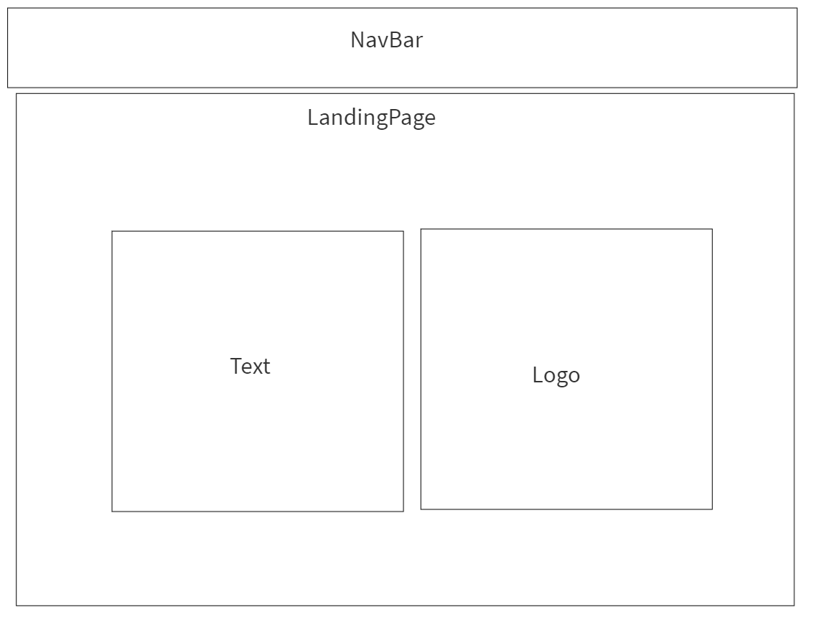
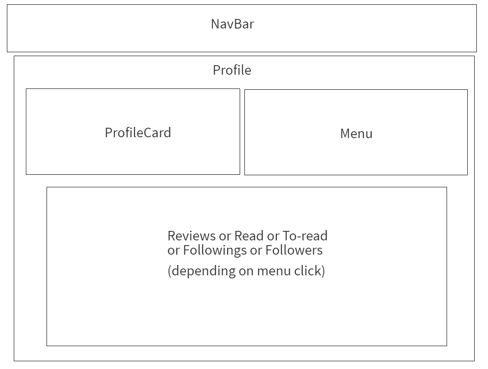
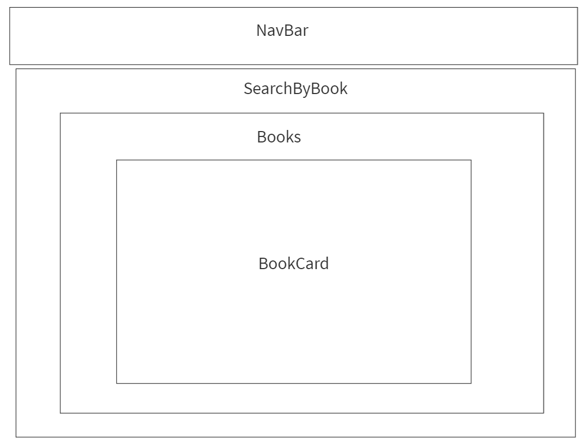
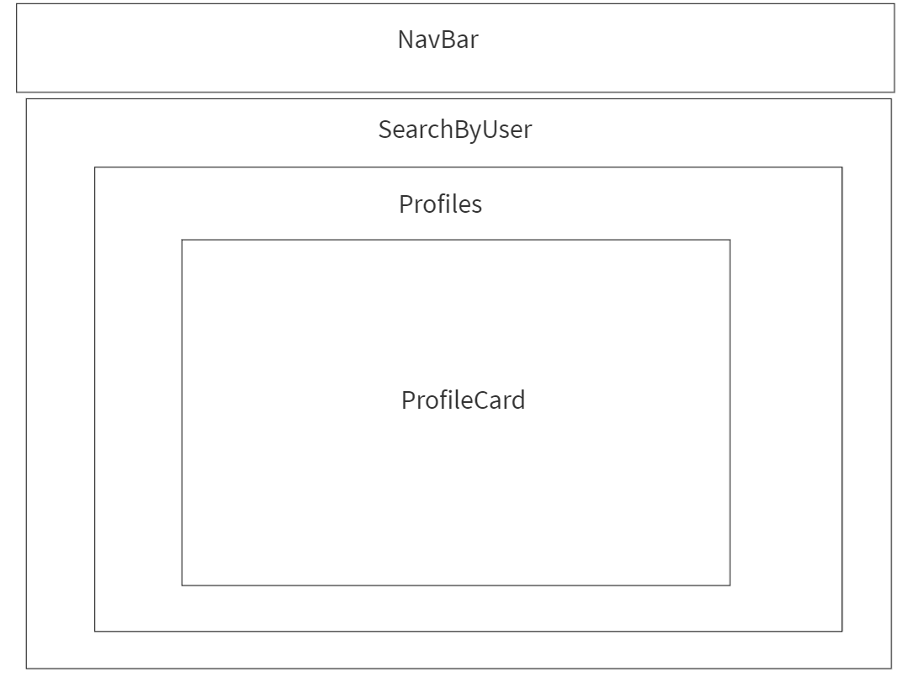
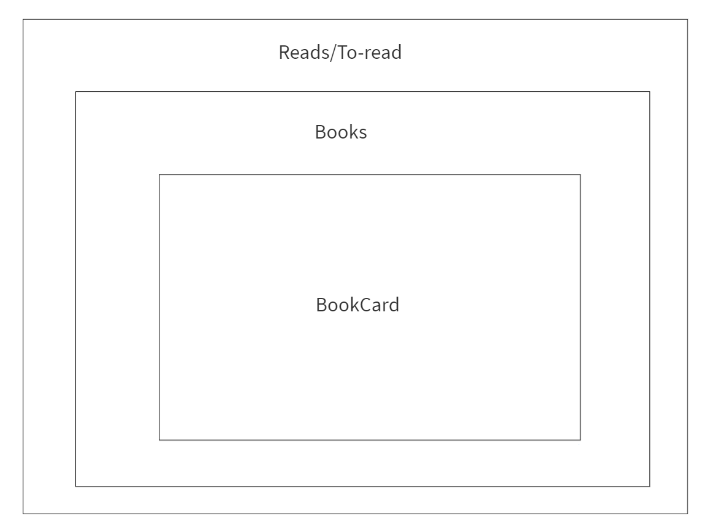
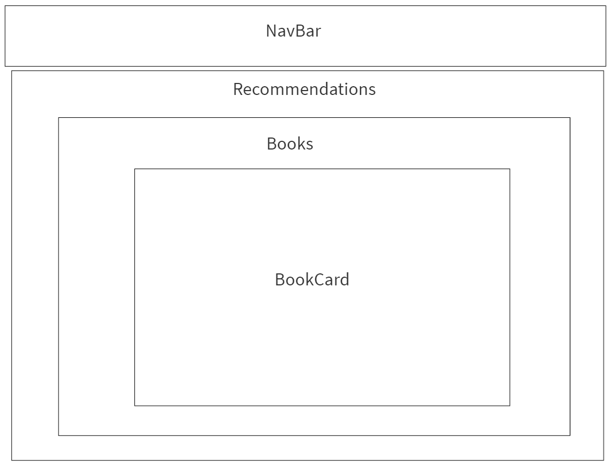

# Bookworm

## Description
The application is about sharing users' opinions and ideas about available books with others. Any user can search for a book or an account. It allows users to follow each other and see their reviews and opinions.

### Technical Used
- MongoDB, Mongoose
- Express
- REACT
- Node.js
- Semantic UI react
- PrimeReact

### WireFrame
- Landing page

- Profile page 

- SerachByBook.png

- SearchByUser.png

- Reads-ToRead.png

- Following-Followers.png

- Recommedations.png

### User Stories
Users have to sign up first then log in to be able to :

#### Users
1. Follow others
1. See other users reviews (partial/regex search)
1. Seacrh for books from google API
1. View book reviews/Leave their reviews
1. Search for other users accounts
1. View our recomndations 
1. Add/remove book from reasds list/To-read list

#### Admin
1. Add/remove books to recomndations

#### Guests
Guests can:
1. Search for books/users
1. View our recomndations 

---

## Planning and Development Process
- Decied on the idea.
- Decided on the needed models
- Created the models and the routes.
- Started with design of the app.
- Created the components.
- Finally we divided the components in different days to work on.

### Unsolved problems
- Edit review
- Add book to recommendation
- Refresh the pages with the latest update

## APIs Used
- Google Books api : used for the books that we want to have in our app 

## Live link
https://ibookworms.herokuapp.com/
---

## Acknowledgments
This project is under the GA academy - by SEI-13 student's (Overcooked 404 team). 
Thank you to all instructors who helped us a lot @Yasir Almuhtarish, @Marco Santonastasi, @haneen-alghamdi, @ali-hamidaddin and to the all members of SEI-13

---

 ## References
- Google Books API https://developers.google.com/books/docs/v1/using
